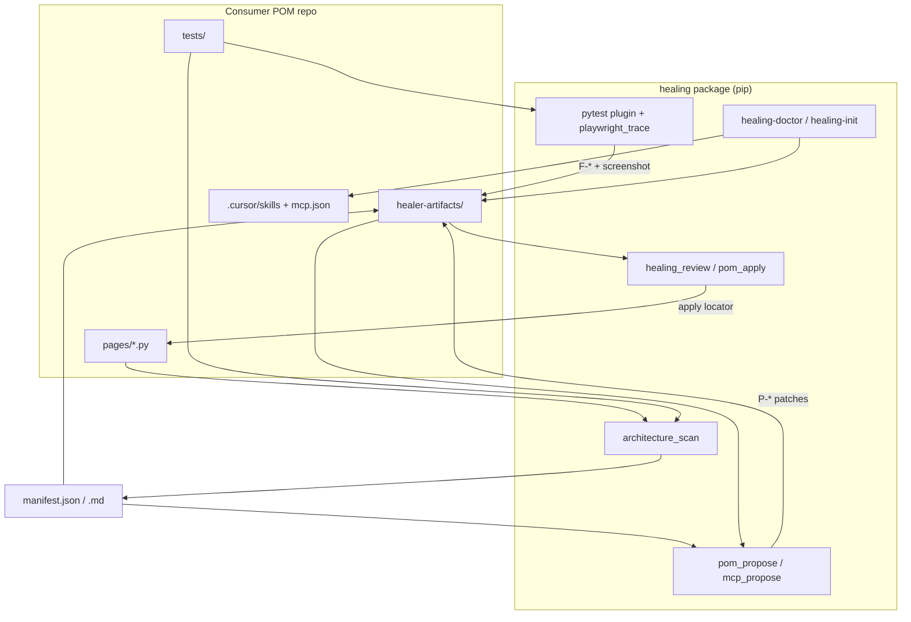
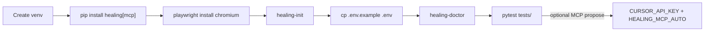

# Playwright Self-Healing Framework (Page Objects)

**QA Chapters Programme — Share**

| | |
|--|--|
| **What it is** | An installable helper package named `healing` (version **0.1.1**) |
| **Where it lives** | [GitHub repo](https://github.com/arunambadikv/self-healing-framework) |
| **Built with** | Python 3.10+, Playwright (browser tests), pytest (test runner). Optional: Cursor tools for automated browser-based suggestions |
| **Who it’s for** | QA engineers, automation engineers, Chapters audience |
| **Important rule** | A **person must approve** before any locator fix is written into page files |
| **Extra files for this page** | [docs/attachments/](attachments/) — upload these into Confluence |

> Tip: upload everything under `docs/attachments/`, then attach those files on this Confluence page where you see 📎.

---

## 1. In plain words — what problem does this solve?

UI tests often fail because the **screen changed**, not because the product is down. A button label changes from “Sign In” to “Login”, a field is renamed, or the layout moves. The test still looks for the old control. Someone then has to figure out:

- Which page class owned that control?
- What steps ran before the failure?
- Is this a real product bug, or just an outdated test locator?

The `healing` package turns that detective work into a **repeatable process** any team using Playwright **page objects** (one class per screen, with locators in Python) can adopt:

1. **Watch & save** — while tests run, record the steps; on failure, save a report, screenshot, and (when possible) the browser session  
2. **Sort the failure** — only “broken locator” cases go into the repair queue; login/session/network/product assertion issues stay for people  
3. **Suggest a small fix** — propose changing one locator on the page class (not rewriting or weakening the test)  
4. **Human decides** — Heal / Skip / Defer before anything is applied to `pages/*.py`

**Guiding idea:** *Help find and suggest the fix. Never silently change page code without a person saying yes.*

Unlike “magic” healing that hides problems at runtime, or AI edits with no trail, this approach keeps **page objects as the single place locators live**, keeps a clear paper trail of failures and proposals, and treats advanced auto-suggest (browser AI / MCP) as **optional** — it needs an API key and Node tooling only if you turn that path on.

---

## 2. Walkthrough — one broken login button

Imagine a login test that still looks for a button named **“Sign In”** after the product renamed it to **“Login”**.

1. You run tests as usual (`pytest`). The healing helper loads automatically with the test runner — you do not wire special hooks by hand.  
2. As the test runs, steps are recorded: open page → type username → type password → click login. The last step is tied to something like `OrangeHrmLoginPage` → `healing_demo_login_button`.  
3. The click times out. The helper writes a failure report (`F-….json` and a readable `.md`), a screenshot, and often a saved browser session so a later tool can reopen the same state.  
4. The sorter labels this a **broken locator** (safe to consider for healing). A network blip or “kicked back to login” session issue is **not** treated as a locator fix.  
5. You refresh the page-object map, create a patch proposal (`P-*`), and optionally let the browser assistant fill in the real “after” locator (the correct “Login” button).  
6. In review, a person chooses **Heal**. Only that one locator on the page class changes. You re-run the test to confirm.

How a proposal moves through the queue:

```text
waiting for proposal → waiting for assistant → ready for review → applied | skipped | deferred | not healable
```

(Technical status names: `pending_proposal` → `awaiting_agent` → `patch_ready` → `applied` | `skipped` | `deferred` | `not_healable`.)

📎 [pipeline-flow.mmd](attachments/pipeline-flow.mmd) · [sample-queue-index.json](attachments/sample-queue-index.json)

---

## 3. How the pieces fit together (architecture)



📎 [architecture-flow.mmd](attachments/architecture-flow.mmd)

### Two different “healing” folders (easy to mix up)

1. **The installed package** — what you get from `pip install`. This is the code you import (`import healing`). Upgrade it with `pip install -U`.  
2. **The working folder for results** — everything the package **writes while you use it** goes under **`healer-artifacts/`** (failure reports, queue, page map, and so on).

Do **not** create a top-level project folder named `healing/` to store reports. Python may pick up that empty folder instead of the real package, and “nothing works.”

First-time setup (`healing-init`) creates a small config file `healer-artifacts/healing.toml` that says where your pages, tests, and result folders live. All the helper commands read that file (in this reference project, similar settings can also live under `[tool.healing]` in `pyproject.toml`).

### What we mean by “architecture” here

Not a system landscape diagram. It means a **catalogue of your page objects**: which screen classes exist, which locators they define, what those locators look like in code, which methods use them, and which tests call them.

You build or refresh that catalogue with:

```bash
healing-scan   # or in Cursor: /architecture-discovery
```

You get:

- `manifest.json` — for tools / automation / CI  
- `manifest.md` — easier for people to read in a review  
- `content_hash` — a fingerprint; if pages/tests did not change, we know the catalogue is still current. A daily “heartbeat” job can compare this to spot quiet drift  

Later steps use this map so suggestions point at a clear target (for example `SauceDemoLoginPage.login_button`), so “before / after” locator text is accurate, and so apply changes **one named locator** under `pages/`. The scan also runs when you first set up, after a package update when you next run tests, or when pages/tests look out of date.

📎 [sample-manifest-excerpt.md](attachments/sample-manifest-excerpt.md) · [sample-manifest-excerpt.json](attachments/sample-manifest-excerpt.json)

### Four layers (what happens under the hood)

1. **Watch** — while tests run, record steps; on failure, save the report, screenshot, and session when possible.  
2. **Understand** — sort the failure type; use the page-object catalogue.  
3. **Suggest** — create a draft patch, then optionally complete it with a live browser look.  
4. **Govern** — a person reviews; apply only under `pages/`; CI can check that the queue is not left rotting.

### Folders after setup

```text
pages/  tests/          ← your page objects and tests (you own these)
healer-artifacts/       ← results: failures, queue, page map, reports, auth, config
.cursor/skills/         ← optional Cursor playbooks copied from the package
.cursor/mcp.json        ← optional browser-assistant config
.env                    ← local secrets — never commit
```

**Out of scope on purpose:** separate YAML locator registries, auto-changing assertions or test flow, and “healing” failures that are not broken locators.

---

## 4. `healing-doctor` — health check before you start

Think of this as a **pre-flight checklist** for any team that installs the package. Live demos usually fail for boring reasons: the browser was never installed, the test helper did not register, a wrongly named `healing/` folder hid the package, or someone expected automatic browser suggestions without Node or an API key. Doctor prints one clear report so you are not stuck with “why are there no failure files?”

It does **not** change your page objects. For the browser check, it only looks for the installed Chromium files on disk — it does not need to open a full browser session.

**Run it:** after first setup (setup runs it by default), after upgrading the package, when capture seems broken, and before turning on auto-suggest in CI (add `--verify-mcp` if you will use the browser assistant).

```bash
healing-doctor
healing-doctor --verify-mcp   # also checks that the browser assistant tooling can start
healing-doctor --strict       # treat warnings as failures (useful in CI)
```

**What each check is asking:**

- **healing package** — can Python load the package? If not: install failed, or a local folder is hiding it.  
- **pytest plugin** — is the helper hooked into the test runner? If not: tests run but **no failure reports** are written.  
- **cursor-sdk** — optional. Warning if you did not install the `[mcp]` extra. Saving failures and human review still work.  
- **chromium** — is the Playwright browser installed? If not: `playwright install chromium`.  
- **npx / mcp.json / CURSOR_API_KEY** — only needed for automated browser-based suggestions.  
- **healing.toml / result folders / skills** — is the working layout present, and can Cursor find the playbooks?

**How to read the summary:** fix **errors** before a demo. **Warnings** about API key / Node / browser assistant are fine if you only want capture + human review. Use `--verify-mcp` when the next step is live auto-suggest.

📎 [healing-doctor-output.txt](attachments/healing-doctor-output.txt)

---

## 5. Cursor slash commands (optional playbooks)

These are short instruction files that ship with the package and get copied into your project by `healing-init` (under `.cursor/skills/`). In Cursor you type `/name` to run them. They do **not** replace the command-line tools — they tell the AI assistant **which commands to run and which rules not to break**. Teams that prefer the terminal can ignore them.

| Command | What it’s for |
|---------|----------------|
| `/healing-init` | First-time setup of folders, playbooks, config templates, then doctor |
| `/architecture-discovery` | Refresh the page-object catalogue (and optional daily drift check) |
| `/healing-propose` | Turn failure reports into patch proposals — **does not apply** |
| `/playwright-locator-repair` | Open the real page in a browser assistant and suggest an exact locator |
| `/healing-review` | Person chooses heal / skip / defer — **this is where apply happens** |

### `/healing-init`

Sets up an existing page-object project: creates `healer-artifacts/` and config, failure/queue/catalogue folders, copies playbooks, adds browser-assistant config and `.env.example` if missing, can scan pages, then runs doctor. It does **not** edit your page or test code. After a package upgrade, re-run with `--force` if playbooks need refreshing. Same thing from the terminal: `healing-init`.

### `/architecture-discovery`

Refreshes the page-object catalogue and summarises what changed (fingerprint, classes, locators). In daily “heartbeat” mode it only reports whether pages/tests changed — no code edits. Use it before suggesting fixes if pages changed, after a big refactor, or on a schedule. Showing `manifest.md` in a Chapters demo makes the idea tangible: “the tool knows this login page has a button locator still named Sign In.” Terminal: `healing-scan`.

### `/healing-propose`

Takes new failure reports and turns them into **reviewable** patch files, without applying them. Keeps the catalogue up to date, creates draft patches, and/or walks the locator-repair path, then marks them ready for review. Must not weaken assertions or skip tests. Common terminal pair: `healing-propose` then `healing-mcp-propose`.

### `/playwright-locator-repair`

The “look at the real screen” path for broken locators: read the failure + catalogue → confirm it’s really a locator issue → open the page (preferring the saved session and the URL where it failed) → take a snapshot → suggest a stable locator (prefer test id, then role/name, then label, and so on; CSS last; avoid fragile XPath when possible) → write **one** suggested change for **one** locator on a page class → send it to review. This keeps “AI healing” tied to what is on the page, not to guesswork.

### `/healing-review`

The only playbook allowed to **apply** changes. Shows context, screenshot, and before → after. The person picks **Heal**, **Skip**, or **Defer**. After that choice, the command runs once (no second “are you sure?” loop). Same idea from the terminal: `healing-review --interactive`. This is the visible safety gate stakeholders care about.

**Usual order:** set up once → tests fail (reports appear automatically) → refresh catalogue if needed → propose (+ locator repair) → review.

---

## 6. What to show in a demo (sample files)

**Failure report (`F-*`)** — open the Markdown in the room; tools use the JSON. Teaching point: steps and “which locator broke” are filled in even if the test author did not add logging.  
📎 [sample-failure-F-orangehrm-broken-login.md](attachments/sample-failure-F-orangehrm-broken-login.md) · [.json](attachments/sample-failure-F-orangehrm-broken-login.json)  
*(Optional: add a real screenshot from a live demo run.)*

**Page-object catalogue** — see section 3.

**Patch proposal (`P-*`)** — drafts may still say “TODO”; completed ones have a real new locator and are marked ready for review.  
📎 [sample-patch-P-orangehrm-broken-login.json](attachments/sample-patch-P-orangehrm-broken-login.json)

**After apply** — only page files change; tests and assertions stay as they are:

```python
# BEFORE (outdated)
return self.page.get_by_role("button", name="Sign In")
# AFTER (approved fix)
return self.page.get_by_role("button", name="Login")
```

📎 [sample-locator-before-after.py](attachments/sample-locator-before-after.py)

---

## 7. Install and day-to-day use



📎 [installation-flow.mmd](attachments/installation-flow.mmd)

| Need | Detail |
|------|--------|
| **Python** | 3.10 or newer |
| **Always** | playwright, pytest, pytest-playwright, pyyaml, rich, python-dotenv |
| **Only for auto browser suggestions** | install with `healing[mcp]`, Node/`npx`, `CURSOR_API_KEY`, Chromium |

```bash
pip install "healing[mcp] @ git+https://github.com/arunambadikv/self-healing-framework.git"
playwright install chromium
healing-init && cp .env.example .env   # add API key only if you use auto-suggest
healing-doctor
pytest tests/ -v
```

Suggest fixes by hand:

```bash
healing-scan && healing-propose --process-all
healing-mcp-propose --process-all
healing-review --interactive
```

Optional auto path (only when a run actually captured healable locator failures): put `HEALING_MCP_AUTO=1` and `CURSOR_API_KEY=…` in `.env`, then run `pytest`.

Built-in demos with **intentionally broken** locators (so you can practise without waiting for a real flake):

```bash
pytest tests/test_orangehrm_healing.py --run-healing-demo -v
# also: tests/test_saucedemo_healing.py
```

**How steps get recorded:** when tests start, the helper watches normal Playwright clicks/fills/navigation, so existing page code like `self.login_button.click()` is enough. An optional shared base page can still help with timeouts and clearer locator names. If watching somehow misses a call, the failure stack trace pointing at `pages/` is used as a backup.

---

## 8. What we heal, CI, and honest limits

Only **broken locators** are treated as healable. Session/login problems, network errors, and product assertion mismatches stay with people — this tool speeds up **locator maintenance**, it does not replace bug triage or test design.

**CI pattern in the reference repo:** run tests → on failure try propose → run queue/policy checks. Working branch: `dev`. Stable branch: `main` (via pull request).

**Hard limits to say out loud in Chapters:**

- No silent apply — a person must decide  
- Only locator breaks are patched; other failure types are recorded for context  
- Page objects are expected under `pages/`  
- Auto browser suggest needs API key + Node + the `[mcp]` install option  
- We do not rewrite assertions or whole test flows  
- Install from Git for now (public package index later)  
- Standard (sync) Playwright is the supported path  
- Store results in `healer-artifacts/`, never in a homemade `healing/` folder  

---

## 9. If something goes wrong

| What you see | What to do |
|--------------|------------|
| No failure report after a red test | Run `healing-doctor`; reinstall; check you did not create a shadowing `healing/` folder |
| Message about `CURSOR_API_KEY` | Copy `.env.example` to `.env` and set the key |
| Browser-assistant / `npx` errors | Install Node 18+; run `healing-doctor --verify-mcp` |
| Chromium missing | `playwright install chromium` |
| Cursor playbooks missing | Run `healing-init` again (add `--force` if needed) |
| Suggestion points at the wrong control | Refresh the catalogue: `healing-scan` or `/architecture-discovery` |

---

## 10. Suggested Chapters demo (about 10–12 minutes)

1. Show the page-object catalogue excerpt (section 3)  
2. Run `healing-doctor` and explain two or three checks in plain words  
3. Run a demo with a broken locator → open the failure write-up + screenshot  
4. Show propose (Cursor playbook or terminal) → before/after on the patch  
5. Review → apply → re-run green; end on: **person decides**, **only page locators change**  

---

## 11. Where to read more

[Consumer setup](CONSUMER_SETUP.md) · [Project status](PROJECT_STATUS.md) · [Architecture heartbeat](ARCHITECTURE_HEARTBEAT.md) · [Demo runbook](HEALING_DEMO.md) · [Operator guide](../AGENTS.md) · [Attachments](attachments/) · [GitHub](https://github.com/arunambadikv/self-healing-framework)

**Suggested Confluence labels:** `qa-chapters`, `playwright`, `self-healing`, `pom`, `python`
